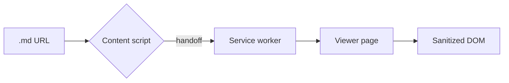
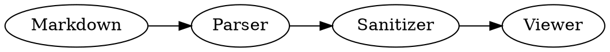

# Markscope feature tour

Markscope renders **GitHub-flavored Markdown** with diagrams, math and a navigable outline — safely. Press <kbd>Ctrl</kbd>/<kbd>⌘</kbd> + <kbd>K</kbd> for commands or <kbd>?</kbd> for shortcuts.

[[toc]]

## Text and inline formatting

You get *emphasis*, **strong**, ~~strikethrough~~, `inline code`, ==highlights==, ++insertions++, H~2~O, E = mc^2^ and smart "quotes" -- plus emoji :rocket: :sparkles:.

Autolinks just work: https://commonmark.org, and so do [relative links](./README.md) — they open inside Markscope.

*[HTML]: HyperText Markup Language
Abbreviations like HTML show their expansion on hover.

## Lists and tasks

- [x] Render GitHub task lists
- [x] Keep checkboxes read-only
- [ ] Ship your docs

1. Ordered lists
2. With nesting
   - Mixed markers
   - And continuation

Term
: Definition lists are supported too.

## Alerts and callouts

> [!NOTE]
> GitHub-style alerts render as callouts.

> [!TIP]
> Use the **Doctor** tab in the sidebar to find broken anchors and missing alt text.

> [!WARNING]
> Raw HTML is sanitized. Scripts never run, even in malicious files.

::: important Custom title
VuePress-style `:::` containers map onto the same callout styles.
:::

::: details Click to expand
Collapsible content with `::: details`.
:::

## Code

```ts
// Copy, language badge and optional line numbers come for free.
export function slugify(text: string): string {
  return text.trim().toLowerCase().replace(/[^\p{L}\p{N} -]/gu, '').replace(/ /g, '-')
}
```

```bash
npm install && npm run build
```

## Tables

| Feature        | Markscope | Notes                        |
| -------------- | :-------: | ---------------------------- |
| GFM tables     |     ✓     | Wide tables scroll sideways  |
| Mermaid        |     ✓     | Lazy-loaded on demand        |
| Math (KaTeX)   |     ✓     | Inline and display           |
| Live reload    |     ✓     | Conditional requests (304)   |

## Math

Inline math like $e^{i\pi} + 1 = 0$ and display math:

$$
\int_{-\infty}^{\infty} e^{-x^2}\,dx = \sqrt{\pi}
$$

## Diagrams





## Footnotes

Markscope keeps footnotes linked both ways.[^1]

[^1]: Like this one. Click the arrow to jump back.

## Next steps

- Open any `.md` URL or drag a file into this window.
- Try **Edit** view (<kbd>2</kbd>) for live preview.
- Enable the optional AI assistant in **Settings → AI**.
