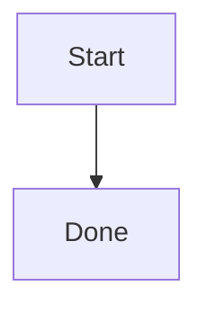
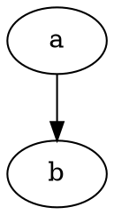

# Guide

Intro paragraph with a needle in it.

[[toc]]

## Installation

Run the installer. Another needle here.

```js
// copy test
console.log('copy me')
```

## Usage

See [the other doc](./other.md#details) and [missing anchor](#does-not-exist).


> [!TIP]
> Alerts render as callouts.

$$
E = mc^2
$$





## Reference

| Key | Value |
| --- | ----- |
| a   | 1     |
